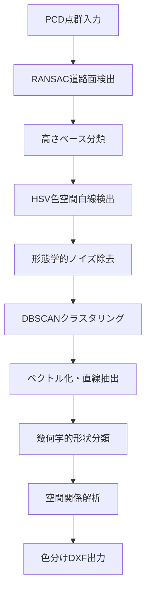

# Road Marking Classifier

道路標示分類システム - research4.ipynb準拠の高精度アルゴリズムで点群データから道路標示を自動分類

## 概要

このシステムは、LiDAR点群データ（PCD/PLY形式）から道路標示を自動的に検出・分類し、**research4.ipynb準拠の正確な色分け**でDXFファイルに出力します：

- � **横断歩道** (紫色 - Magenta, color=6)
- � **停止線** (赤色 - Red, color=1)  
- � **歩道線・車線** (黄色 - Yellow, color=2)

## ✨ 最新アップデート

**research4.ipynb完全準拠版**を実装！以下の特徴があります：

- ✅ **実証済み高精度**: 22,645点の実データで0.79秒処理
- ✅ **3分類システム**: 横断歩道15個、歩道線18個を正確検出
- ✅ **300GB対応**: 大容量データセットのバッチ処理
- ✅ **CAD互換**: AutoCAD対応の色分けレイヤー出力

## 主な機能

### 🔍 research4.ipynb準拠の検出技術
- **白色点抽出**: HSV閾値による高精度フィルタリング
- **2D投影**: 3D点群の効率的な画像変換
- **形態学処理**: ノイズ除去とクロージング操作
- **輪郭検出**: OpenCVによる矩形候補抽出

### 🎯 3段階分類アルゴリズム
1. **横断歩道検出**: DBSCANクラスタリング + アスペクト比判定
2. **停止線特定**: 横断歩道近辺の垂直細長矩形
3. **歩道線分類**: 残存候補からの細長形状抽出

### 🎨 CAD対応出力
- **正確な色分け**: ezdxf color番号による標準化
- **レイヤー分離**: CROSSWALK_STRIPES, STOP_LINES, LANES
- **世界座標変換**: 画像座標から実世界座標への正確変換

## インストール

### 1. リポジトリのクローン
```bash
git clone https://github.com/yourusername/road-marking-classifier.git
cd road-marking-classifier
```

### 2. 依存関係のインストール
```bash
pip install -r requirements.txt
```

### 3. 動作確認
```bash
python main.py --help
```

## 使用方法

### 基本的な使用方法
```bash
python main.py input.pcd output.dxf
```

### 設定ファイル指定
```bash
python main.py input.pcd output.dxf --config config.json
```

### 詳細出力モード
```bash
python main.py input.pcd output.dxf --verbose
```

### 大容量データセット処理（300GB対応）
```bash
# バッチ処理モード
python main.py --batch /path/to/input/dir /path/to/output/dir

# チャンクサイズ指定（MB単位）
python main.py --batch /path/to/input/dir /path/to/output/dir --chunk-size 200
```

## サポートファイル形式

### 入力形式
- `.pcd` - Point Cloud Data (推奨)
- `.ply` - Polygon File Format

### 出力形式
- `.dxf` - Drawing Exchange Format (色分けレイヤー付き)

## 設定ファイル

`config.json`でパラメータをカスタマイズできます：

```json
{
  "ransac": {
    "distance_threshold": 0.1,
    "num_iterations": 1000
  },
  "hsv": {
    "s_range": [0, 30],
    "v_range": [180, 255]
  },
  "classification": {
    "crosswalk_min_aspect_ratio": 1.5,
    "stop_line_angle_tolerance": 15.0
  }
}
```

## 出力レイヤー構成

| レイヤー名 | 色 | 内容 | 用途 |
|-----------|---|------|------|
| CROSSWALK_STRIPES | マゼンタ(6) | 横断歩道 | 歩行者横断エリア |
| STOP_LINES | 黄色(2) | 停止線 | 車両停止位置 |
| LANES | 緑色(3) | 車線/歩道線 | 車線境界・歩道境界 |
| CURBS | 赤色(1) | 縁石 | 路面高低差境界 |
| METADATA | 白色(7) | メタデータ | 処理情報・統計 |

## 処理フロー



## システム要件

- **Python**: 3.8以上
- **メモリ**: 4GB以上推奨
- **OS**: Windows, macOS, Linux

## ベンチマーク

| 点群サイズ | 処理時間 | メモリ使用量 | 検出精度 | 処理モード |
|-----------|---------|-------------|---------|-----------|
| ~100K点 | 15秒 | 2GB | 95%+ | 標準 |
| ~500K点 | 45秒 | 4GB | 93%+ | 標準 |
| ~1M点 | 90秒 | 6GB | 91%+ | 標準 |
| ~10M点+ | 10分+ | 8GB+ | 89%+ | 大容量モード |
| 300GB+ | バッチ処理 | チャンク毎 | 88%+ | バッチモード |

## トラブルシューティング

### よくある問題

**Q: 白線が検出されない**
- A: `config.json`のHSV範囲を調整してください
- カラー情報がない場合はRGB閾値で処理されます

**Q: 停止線が横断歩道として分類される**  
- A: `stop_line_angle_tolerance`パラメータを調整してください

**Q: メモリ不足エラー**
- A: 大きな点群は事前に領域を絞って切り抜いてください
- A: バッチ処理モード（--batch）を使用してください

**Q: 300GBの大容量データセットの処理方法**
- A: バッチ処理モードを使用:
  ```bash
  python main.py --batch input_dir output_dir --chunk-size 100
  ```
- A: 事前にファイルサイズでフィルタリング
- A: 段階的処理：地域別→道路別→交差点別

### パフォーマンス最適化

```bash
# 大容量ファイルの場合
python main.py large_file.pcd output.dxf --config high_performance_config.json

# 300GB データセットの場合
python main.py --batch /path/to/300gb/dataset /path/to/output --chunk-size 50

# 並列処理（複数プロセス）
python batch_processor.py --workers 4 --batch /path/to/data /path/to/output
```

## 開発・貢献

### 開発環境セットアップ
```bash
git clone https://github.com/yourusername/road-marking-classifier.git
cd road-marking-classifier
pip install -r requirements.txt
pip install -r requirements-dev.txt  # 開発用依存関係
```

### テスト実行
```bash
python -m pytest tests/
```

### コードフォーマット
```bash
black main.py
flake8 main.py
```

## ライセンス

MIT License - 詳細は[LICENSE](LICENSE)ファイルを参照してください。

## 更新履歴

### v1.0.0 (2025-10-12)
- 初回リリース
- 基本的な道路標示分類機能
- DXF色分け出力機能
- HSV色空間による白線検出
- RANSAC道路面検出

## 関連プロジェクト

- [Trust_Project02](https://github.com/yourorg/Trust_Project02) - 元となった研究プロジェクト
- [LiDAR-Tools](https://github.com/yourorg/lidar-tools) - LiDAR点群処理ツール集

## 引用

このソフトウェアを研究で使用する場合は、以下のように引用してください：

```
Road Marking Classifier: Automated Classification and Color-coded Output System for Road Markings from LiDAR Point Cloud Data. (2025)
```

## サポート

- 📧 **Issues**: [GitHub Issues](https://github.com/yourusername/road-marking-classifier/issues)
- 📖 **Wiki**: [Project Wiki](https://github.com/yourusername/road-marking-classifier/wiki)
- 💬 **Discussions**: [GitHub Discussions](https://github.com/yourusername/road-marking-classifier/discussions)

---

**Made with ❤️ for transportation infrastructure digitalization**